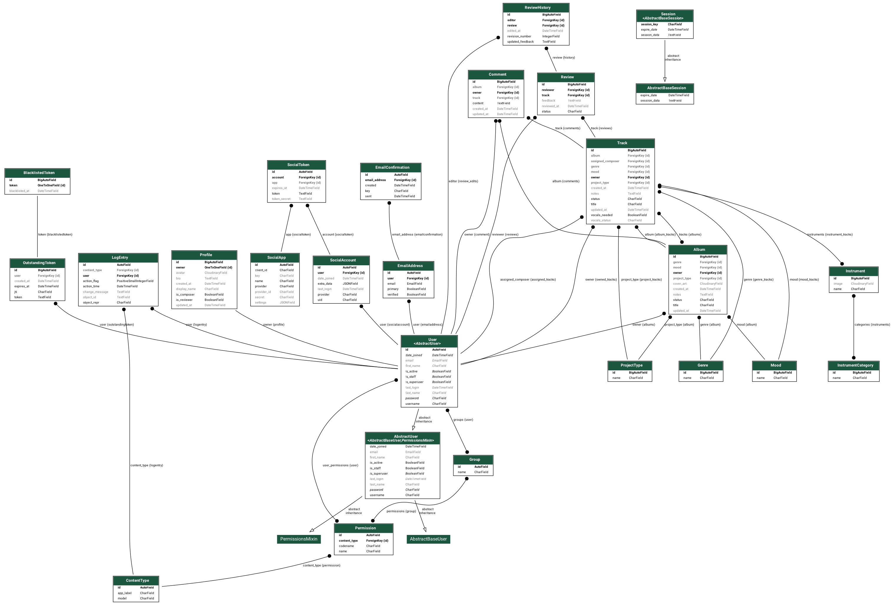

# Track Management API - Backend README

## 🎵 Overview

This is a **Track Management API** designed for composers and reviewers to efficiently manage tracks, albums, instruments, and track statuses. The API enables:

-   **Track creation, editing, and deletion** (by composers only)
-   **Comment system** for feedback and collaboration
-   **Review system** (future implementation)
-   **Filtering and searching** by genre, mood, status, project type, and vocals needed
-   **Role-based access control** (Composers vs. Reviewers)

This API is built to scale with additional features like **album bulk updates, reviews, and audio file imports** in future releases.

---

## 🚀 Features

-   **Tracks:** CRUD operations with status management
-   **Comments:** Threaded discussions per track
-   **Review System:** (Future Feature) Feedback & revision tracking for composers
-   **Albums:** (Future feature) Group tracks, add cover art, and manage updates
-   **Filtering & Search:** Quickly locate tracks based on metadata
-   **Authentication:** Secure JWT-based authentication with role-based permissions

## 🧩 Entity Relationship Diagram (ERD)

The following diagram outlines the core models and their relationships within the Track Management API, including user accounts, tracks, albums, comments, and associated metadata.



## 🛠 Tech Stack

-   **Backend:** Django 4.2, Django REST Framework
-   **Database:** PostgreSQL
-   **Authentication:** dj-rest-auth with JWT tokens
-   **Deployment:** Heroku
-   **Other Tools:** Django Filters, Django CORS Headers

---

## 🏗 Setup & Installation

### 1️⃣ Clone the Repository

```sh
git clone <repo_url>
cd backend
```

### 2️⃣ Create and Activate Virtual Environment

```sh
python -m venv .venv
source .venv/bin/activate  # macOS/Linux
.venv\Scripts\activate     # Windows
```

### 3️⃣ Install Dependencies

```sh
pip install -r requirements.txt
```

### 4️⃣ Set Up Environment Variables

Create a `.env` file in the root directory and add:

```env
SECRET_KEY=your-secret-key
DEBUG=True
DATABASE_URL=your-database-url
CORS_ALLOWED_ORIGINS=http://localhost:3000
```

### 5️⃣ Apply Migrations & Create Superuser

```sh
python manage.py migrate
python manage.py createsuperuser
```

### 6️⃣ Run the Development Server

```sh
python manage.py runserver
```

---

## ☁️ Deployment (Heroku)

### 🔧 1. Create a New App on Heroku

-   Go to [Heroku Dashboard](https://dashboard.heroku.com/)
-   Click **New → Create new app**
-   Name your app and choose your region

### 🛠 2. Set Up Environment Variables

In your app’s **Settings → Reveal Config Vars**, add:

```env
SECRET_KEY=your-django-secret-key
DEBUG=False
DATABASE_URL=auto-generated-by-heroku
ALLOWED_HOSTS=your-app-name.herokuapp.com
CORS_ALLOWED_ORIGINS=https://your-frontend-url.com
```

### 🥍 3. Add Heroku PostgreSQL

```bash
heroku addons:create heroku-postgresql:hobby-dev
```

### 📦 4. Prepare Your Code for Deployment

Install Gunicorn:

```bash
pip install gunicorn
pip freeze > requirements.txt
```

Create a `Procfile` in your root directory and add:

```bash
web: gunicorn mp_api.wsgi --log-file -
```

Commit your changes:

```bash
git add .
git commit -m "Prepare for Heroku deployment"
```

### ✨ 5. Push to Heroku

```bash
heroku git:remote -a your-heroku-app-name
git push heroku main
```

### 🔄 6. Run Migrations on Heroku

```bash
heroku run python manage.py migrate
```

### 🔐 7. (Optional) Create a Superuser

```bash
heroku run python manage.py createsuperuser
```

## ✅ Testing

This project has been tested using **automated unit tests** and **manual API tests**.

-   **Automated Tests:** Django's built-in test framework was used for **authentication, CRUD operations, and role-based access.**
-   **Manual API Testing:** Postman was used to verify **correct responses and error handling.**
-   **PEP8 Compliance:** The code was checked against PEP8 for formatting errors.

📌 **For a detailed breakdown of testing results, see [`TESTING.md`](TESTING.md).**

### **Tested Scenarios:**

✅ Authentication (Login/Logout) works correctly.  
✅ CRUD operations for Tracks & Comments.  
✅ Non-authorized users **cannot** access or modify tracks.

---

## 🚀 Future Enhancements

-   **Review System**: Allow reviewers to provide structured feedback.
-   **Audio File Upload**: Composers can attach preview tracks.
-   **Better Search & Filters**: More granular search capabilities.
-   **Bulk Album Edits**: Manage track statuses quickly.

---

## 🎯 Conclusion

This API is built for **speed, efficiency, and scalability**, ensuring a smooth workflow for composers and producers in the music industry. The backend is structured with **future growth in mind**, making it easy to add new features as needed.

---
